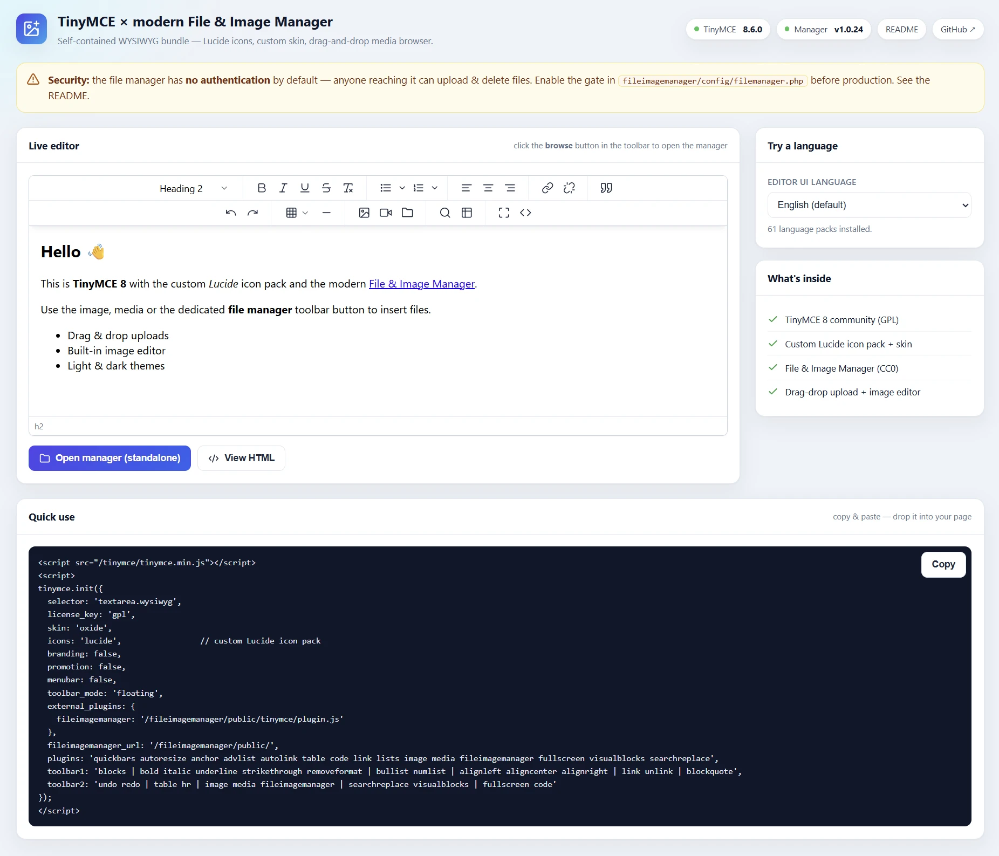

# TinyMCE with integrated modern File &amp; Image Manager



A ready-to-run bundle that glues together three things into one folder:

- **[TinyMCE 8](https://github.com/tinymce/tinymce)** — community / GPL build + all language packs
- a **custom [Lucide](https://lucide.dev/) icon pack** with a refined skin
- **[File &amp; Image Manager](https://github.com/radekhulan/fileimagemanager)** — a modern Vue 3 + PHP file browser with drag-and-drop uploads and a built-in image editor

One script downloads and wires everything together — **no Composer, no npm build**. Re-run it any time to update to the latest versions.

> ⚠️ **Security:** the file manager ships **without authentication** so the demo works instantly. Anyone who can reach it can upload, rename and **delete** files. **Lock it down before production** — see [Security](#security).

---

## Requirements

- **PHP 8.x** (the manager targets PHP 8.5; tested with the bundled `c:\inetpub\php\php.exe`)
- A web server — **IIS** (`web.config` included) or **Apache** (`.htaccess` included), or just the built-in PHP server for trying it out
- For setup: PowerShell 5+ (Windows) or `bash` + `curl` + `unzip` (Linux/macOS)

---

## Quick start

```powershell
# Windows (PowerShell)
.\setup.ps1
```

```bash
# Linux / macOS
chmod +x setup.sh && ./setup.sh
```

This downloads TinyMCE, the language packs and the File &amp; Image Manager, injects the custom icons/skin, patches the manager config and prints where to open it.

### Try it without a web server

```powershell
.\dev-server.ps1            # Windows  → http://localhost:8080/
```
```bash
./dev-server.sh             # Linux/macOS
```

The dev server listens on every interface by default and prints both the **localhost** URL and your **LAN IP** (e.g. `http://192.168.1.20:8080/`) so you can open the project from another device. `0.0.0.0` in PHP's own startup line is just the bind address — open `localhost` or the printed network IP, not `0.0.0.0`.

| Flag | Effect |
|---|---|
| `-Port 9000` / `--port 9000` | Use a different port |
| `-LocalOnly` / `--local-only` | Bind to localhost only (not on the network) |
| `-NoBrowser` / `--no-browser` | Don't auto-open the browser |

---

## What the setup script does

1. Resolves the latest **TinyMCE** version (npm registry) and downloads the community GPL zip → `wysiwyg/tinymce/`.
2. Downloads all **language packs** → `wysiwyg/tinymce/langs/`.
3. Copies the **custom Lucide pack** to `wysiwyg/tinymce/icons/lucide/`, the skin to `wysiwyg/tinymce/custom.css`, and replaces the stock `default` icon pack with an empty placeholder (required — it errors once the Lucide pack is active).
4. Resolves the latest **File &amp; Image Manager** release and unpacks the prebuilt zip → `wysiwyg/fileimagemanager/` (ships with `vendor/` and built `public/assets/`, so no build step), and wires its TinyMCE plugin into `wysiwyg/tinymce/plugins/fileimagemanager/`.
5. **Patches** `wysiwyg/fileimagemanager/config/filemanager.php` so uploads live in the repo-root `media/` folder (`media/source` + `media/thumbs`, committed alongside the project, URLs resolved at runtime so it works under any mount path) and injects a clearly-labelled **disabled** security gate.
6. Writes `.bundle-version.json` and prints the URLs + a security reminder.

Pin versions if you need to:

```powershell
.\setup.ps1 -TinymceVersion 8.6.0 -FimVersion v1.0.24
```
```bash
./setup.sh --tinymce-version 8.6.0 --fim-version v1.0.24    # or --skip-langs
```

### Updating

Just run the setup script again. It pulls the latest of both and re-applies the customisations. **Your uploads** in `media/` and an **edited config** are preserved; pin a version to stay put.

---

## Project structure

```
tinymce-imagemanager/
├─ setup.ps1 / setup.sh           # install & update
├─ dev-server.ps1 / dev-server.sh # run under PHP's built-in server
├─ router.php                     # front-controller shim for the dev server
├─ index.php                      # demo / landing page
├─ web.config / .htaccess         # IIS / Apache config for the root
├─ custom/                        # tracked source of the customisations
│  ├─ icons.js                    #   custom Lucide icon pack
│  ├─ custom.css                  #   skin overrides
│  ├─ default-icons.min.js        #   empty default pack placeholder
│  └─ patch-config.php            #   config patcher used by setup
├─ media/                         # uploads, tracked in git
│  ├─ source/                     #   files served to the editor (current_path)
│  └─ thumbs/                     #   thumbnail cache
└─ wysiwyg/                       # ⤓ downloaded (git-ignored)
   ├─ tinymce/                    #   TinyMCE + Lucide icons + bundled plugin
   └─ fileimagemanager/           #   File & Image Manager (prebuilt release)
```

Only the glue and `media/` are tracked in git; `wysiwyg/` (TinyMCE + the manager) is fetched by setup.

---

## Use it in your own app

Include TinyMCE and point a `<textarea>` at it:

```html
<script src="/tinymce-imagemanager/wysiwyg/tinymce/tinymce.min.js"></script>
<textarea class="wysiwyg"></textarea>
<script>
tinymce.init({
  selector: 'textarea.wysiwyg',
  license_key: 'gpl',
  skin: 'oxide',
  icons: 'lucide',                 // custom Lucide icon pack
  branding: false,
  promotion: false,
  menubar: false,
  toolbar_mode: 'floating',
  // The plugin is bundled inside wysiwyg/tinymce/plugins/fileimagemanager/, so it
  // loads via the `plugins` list below — no external_plugins needed.
  fileimagemanager_url: '/tinymce-imagemanager/wysiwyg/fileimagemanager/public/',
  fileimagemanager_dragdrop: true, // drop images straight onto the editor (default: true)
  plugins: 'quickbars autoresize anchor advlist autolink table code link lists image media fileimagemanager fullscreen visualblocks searchreplace',
  toolbar1: 'blocks | bold italic underline strikethrough removeformat | bullist numlist | alignleft aligncenter alignright | link unlink | blockquote',
  toolbar2: 'undo redo | table hr | image media fileimagemanager | searchreplace visualblocks | fullscreen code'
});
</script>
```

The demo page (`index.php`) generates this snippet with the correct paths for your mount — open it and copy from the **Quick use** panel.

### The options that matter

| Option | Why |
|---|---|
| `icons: 'lucide'` | Loads the custom pack from `wysiwyg/tinymce/icons/lucide/` and auto-injects `custom.css`. |
| `license_key: 'gpl'` | Runs the community build without a Tiny Cloud key. |
| `plugins: '… fileimagemanager …'` | Loads the bundled plugin from `wysiwyg/tinymce/plugins/fileimagemanager/` — adds the toolbar button, the native image/media/link file picker, **and** drag & drop. |
| `fileimagemanager_url` | URL of `wysiwyg/fileimagemanager/public/`; opened in a same-origin dialog iframe. |
| `fileimagemanager_dragdrop` | `true`/`false` per editor — drop images straight onto the editor (default `true`). |
| `fileimagemanager_title` | Optional dialog title. `fileimagemanager_crossdomain: true` enables cross-domain mode. |

### Drag & drop

With the plugin active, dropping image files straight onto the editor uploads them (no file manager needed) and opens a small window to insert each one — as a **preview linked to the full image** or as the **full image**. It works with multiple editors on one page. The target folder is set server-side (`dragdrop_path`, e.g. `cms/{YYYY}/{MM}/{DD}`, created on demand) and the feature can be turned off globally (`dragdrop_upload`) or per editor (`fileimagemanager_dragdrop: false`).

### Custom icons

`custom/icons.js` registers an outlined Lucide pack under the name `lucide` and, when loaded, injects the sibling `wysiwyg/tinymce/custom.css`. Because the Lucide pack supplies every icon, the stock `default` pack is replaced with an empty placeholder during setup — without that, TinyMCE throws when both are active. Edit the look in `custom/custom.css` and re-run setup (or copy it to `wysiwyg/tinymce/custom.css` directly); bump the `?v=` cache-buster at the bottom of `custom/icons.js` when you change it.

---

## Security

The manager has **no built-in login**. As installed, anyone who can reach the URL can upload, rename and delete files. Pick at least one:

**1. Session gate (recommended).** Open `wysiwyg/fileimagemanager/config/filemanager.php` and uncomment the block at the top, then set the flag after your own login:

```php
if (session_status() === PHP_SESSION_NONE) {
    // session_name('YOURAPP');   // share the session cookie with your admin
    session_start();
}
if (empty($_SESSION['ImageEditorAllowed'])) {
    http_response_code(403);
    exit('Access denied');
}
```

```php
// elsewhere, after the user logs in to your admin:
$_SESSION['ImageEditorAllowed'] = true;
```

**2. Access keys (no session system).** In the same config:

```php
'use_access_keys' => true,
'access_keys'     => ['change-me-to-a-long-random-string'],
```

Then open the manager with `?akey=change-me-to-a-long-random-string`.

**3.** Or keep the whole `wysiwyg/fileimagemanager/` folder behind your admin auth, a VPN, or an IP allow-list.

The manager also enforces a CSRF token, an upload extension blacklist and `realpath()` path-traversal checks — but none of that is a substitute for the access control above.

---

## Licenses

| Component | License | Notes |
|---|---|---|
| **This bundle** (scripts, demo, `custom/`) | [CC0 1.0](LICENSE) | Public domain — © Radek Hulán |
| **Lucide** icon shapes in `custom/icons.js` | ISC | © Lucide Contributors |
| **TinyMCE** | [GPL-2.0-or-later](LICENSE-TINYMCE.txt) | © Tiny Technologies — community build via `license_key: 'gpl'`; commercial use needs a Tiny Cloud subscription |
| **File &amp; Image Manager** | [CC0 1.0](LICENSE-FILEIMAGEMANAGER.txt) | © Radek Hulán |

TinyMCE and the File &amp; Image Manager are downloaded by the setup script and are **not** stored in this repository; their own license files ship inside the downloaded folders.

---

Built by **[Radek Hulán](https://mywebdesign.dev/)**.
